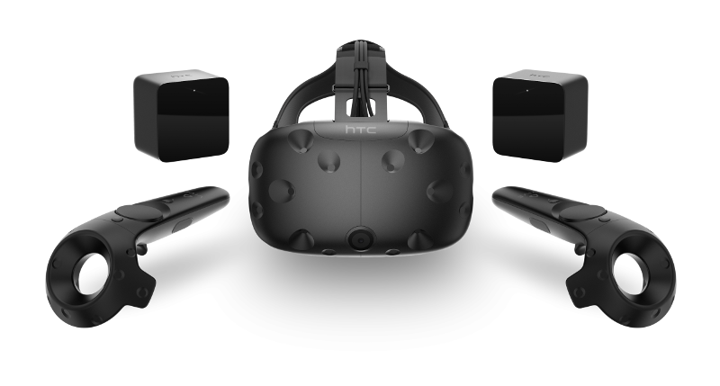

<!-- .slide: data-background="media/img/sld_logo-logo.png" -->

------

<!-- .slide: data-background="media/img/less-buzz-more-bite.png" -->

<!-- NOTES -->
- 

------

<!-- .slide: data-background="media/img/references.jpg" -->

<!-- NOTES -->

------

# Virtual Reality

<!-- .slide: data-background-video="media/video/virtualreality.mp4" data-background-video-loop="true" data-state="state--bg-dark" -->

<!-- NOTES -->
- Kolko ludi uz skusalo VR?
- VR - technologicka platforma, ktora ma silu preniest cloveka do virtualneho 3D sveta
- Taktiez ma silu zmenit ako pracujeme a komunikujeme

------

  <h1>VR/AR @ Sleighdogs</h1>
  
Virtual and Augmented Reality Development Department

<!-- NOTES -->
- My v SLD si myslime, ze VR/AR/MR je buducnost
- Pocas februara a marca chceme postavit team

------

  <h1>Use cases</h1>
  
Educational Tools

  
Architectural Visualizations

  
Medical visualizations

  
Construction visualizations and tools

  
Collaboration Tools

  
Therapy

<!-- NOTES -->
- Novy department bude pracovat pre klientov s roznym zameranim

------

  

  

  

  

  

  

<!-- NOTES -->
- Chceme sa zamerat na vsetky typy VR zariadeni

------

# WebVR

An open virtual reality platform with the advantages of **the Web**

  

    
    <i>Open</i>
  

  

    
    <i>Connected</i>
  

  

    
    <i>Instant</i>
  

<!-- NOTES -->
WebVR is...virtual reality in the browser, powered by the Internet

Open:
- Anyone can publish
- Open source culture with open standards

Connected:
- Traverse worlds

Instant:
- Click a link on Twitter or Weibo, immediate VR experiences
- No installs
- Imagine for long tail experiences: shopping & personal spaces
- Great for long tail bite-sized experiences

Transition:
- Web has advantages that make it the best platform for the people
- Need to act to make it reality, can't wait for VR to bake and crystallize
- Get involved

------

  <h1>Skills</h1>
  
HTML5, CSS, JavaScript (React, Redux, Three.js)

  
Unity (C#) / Unreal Engine 4 (C++)

  
3DS Max, Cinema 4D, Blender

------

  <h1>Want to join the journey?</h1>
  
michal@sld.gs

  
CV / LinkedIn

  
http://sld.gs

  
FB: Sleighdogs

  
Twitter: @Sleighdogs

<!-- NOTES -->
- Chcete sa pridat? Napiste mail, pridajte CV/LinkedIn, poslite fb/twitter

------

<!-- .slide: data-background-video="media/video/quill_medium.mp4" data-state="state--bg-dark" -->